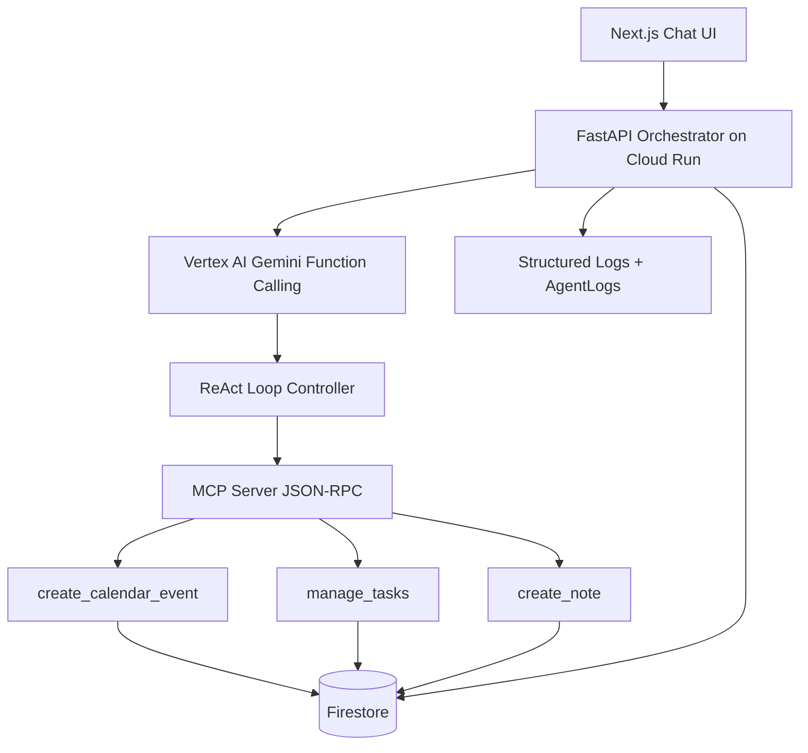

# CASCADE - AI-Powered Self-Healing Workflow Engine

[](https://www.python.org/)
[](https://fastapi.tiangolo.com/)
[](https://cloud.google.com/run)
[](https://cloud.google.com/vertex-ai)
[](https://modelcontextprotocol.io/)

CASCADE is a production-grade multi-agent AI system that models work as a dependency graph and auto-heals workflows when disruptions occur.
It combines Vertex AI function-calling, MCP tool execution, and DAG-based cascade logic to keep tasks, schedules, and notes synchronized in real time.

## 1. Demo Preview
When a user changes one event, CASCADE automatically updates dependent items and explains the reasoning.

Example input:
```text
Move my 10 AM meeting to 3 PM
```

Example output:
```text
Meeting updated to 3 PM.
4 dependent items adjusted.
Your day just healed itself.
```

## 2. Core Idea
Traditional productivity tools treat updates as isolated operations. CASCADE treats work as a connected system.

Problem solved:
- One schedule change often breaks multiple downstream tasks.
- Users manually repair calendars, tasks, and notes.

What makes CASCADE unique:
- Dependency-aware DAG model across tasks and events.
- AI-driven cascade decisions using Gemini instead of fixed rules only.
- Real-time visual ripple updates via SSE + React Flow.

Why it is better than traditional systems:
- It does not stop at execution; it adapts the entire workflow.
- It gives explainable outcomes, timelines, and recommendations.
- It is deployable, observable, and production-ready.

## 3. Architecture


Component explanation:
- UI: Chat + DAG visualization for user interaction and ripple feedback.
- API: FastAPI orchestrator that coordinates agents and workflows.
- Vertex AI: Gemini decides tool calls and multi-step reasoning.
- ReAct Loop: Iterative think-act-observe loop for complex workflows.
- MCP: Standardized tool execution interface for calendar, tasks, notes.
- Firestore: Source of truth for state, memory, dependencies, and logs.
- Logs: Structured telemetry for observability and explainability.

## 4. Features
- Multi-Agent AI system with orchestrator + specialist agents.
- DAG-based dependency engine for parent-child workflow edges.
- Cascade ripple updates with recursive propagation.
- AI-driven scheduling decisions for non-conflicting updates.
- Real-time SSE updates for live progress visualization.
- Undo mechanism for cascade rollback.
- Story mode explanations for human-readable impact summaries.
- Timeline visualization of step-by-step cascade actions.
- MCP tool integration for portable and extensible tool calls.

## 5. How It Works
1. User sends a natural-language request.
2. Orchestrator invokes Gemini function-calling.
3. Gemini selects tool actions.
4. Orchestrator calls MCP tools.
5. State is persisted in Firestore.
6. Dependency engine resolves impacted nodes.
7. Cascade engine propagates updates recursively.
8. SSE streams progress to UI.
9. UI animates ripple timeline on graph.

## 6. Tech Stack
| Layer | Tech |
| ----- | ---- |
| Frontend | Next.js, React, React Flow |
| API | FastAPI, Pydantic |
| Agent Intelligence | Vertex AI Gemini Function Calling, ReAct Loop |
| Tool Protocol | Model Context Protocol (MCP), JSON-RPC |
| Data Layer | Firestore |
| Streaming | Server-Sent Events (SSE) |
| Deployment | Docker, Cloud Run, Artifact Registry |
| Security | JWT, RBAC, Secret Manager |
| Testing | Pytest |

## 7. Project Structure
```text
backend/
  app/
    agents/
    api/
    core/
    db/
    mcp_client/
    middleware/
    models/
    services/
    utils/
    main.py
  tests/
  requirements.txt
  Dockerfile

frontend/
  app/
    page.tsx
    globals.css
    layout.tsx
  package.json

mcp-server/
  tools/
  server.py
  requirements.txt
  Dockerfile
```

## 8. Local Setup
### Backend
```bash
cd backend
python -m venv .venv
# Windows PowerShell
.venv\Scripts\activate
pip install -r requirements.txt
copy .env.example .env
uvicorn app.main:app --host 0.0.0.0 --port 8080
```

### MCP Server
```bash
cd mcp-server
python -m venv .venv
# Windows PowerShell
.venv\Scripts\activate
pip install -r requirements.txt
uvicorn server:app --host 0.0.0.0 --port 9000
```

### Frontend
```bash
cd frontend
npm install
npm run dev
```

## 9. Environment Variables
Backend and MCP services use environment variables for runtime configuration.

Required:
- GOOGLE_CLOUD_PROJECT: Google Cloud project ID.
- FIRESTORE_DATABASE: Firestore DB name, default is (default).
- MCP_SERVER_URL: MCP server base URL used by orchestrator.
- JWT_SECRET: Local/dev JWT secret.

Production recommendation:
- Store secrets in Secret Manager and inject through Cloud Run.

## 10. Cloud Run Deployment
### 1) Enable required APIs
```bash
gcloud services enable \
  run.googleapis.com \
  cloudbuild.googleapis.com \
  artifactregistry.googleapis.com \
  aiplatform.googleapis.com \
  firestore.googleapis.com \
  secretmanager.googleapis.com
```

### 2) Create Artifact Registry repository
```bash
gcloud artifacts repositories create cascade-repo \
  --repository-format=docker \
  --location=us-central1
```

### 3) Build and push backend image
```bash
cd backend
gcloud builds submit \
  --tag us-central1-docker.pkg.dev/<PROJECT_ID>/cascade-repo/backend:latest
```

### 4) Deploy backend to Cloud Run
```bash
gcloud run deploy cascade-backend \
  --image us-central1-docker.pkg.dev/<PROJECT_ID>/cascade-repo/backend:latest \
  --region us-central1 \
  --platform managed \
  --allow-unauthenticated \
  --set-env-vars GOOGLE_CLOUD_PROJECT=<PROJECT_ID>,MCP_SERVER_URL=https://<MCP_SERVICE_URL>,ENABLE_FIRESTORE=true
```

### 5) Build and push MCP image
```bash
cd ../mcp-server
gcloud builds submit \
  --tag us-central1-docker.pkg.dev/<PROJECT_ID>/cascade-repo/mcp:latest
```

### 6) Deploy MCP server to Cloud Run
```bash
gcloud run deploy cascade-mcp \
  --image us-central1-docker.pkg.dev/<PROJECT_ID>/cascade-repo/mcp:latest \
  --region us-central1 \
  --platform managed \
  --allow-unauthenticated \
  --set-env-vars GOOGLE_CLOUD_PROJECT=<PROJECT_ID>,FIRESTORE_DATABASE=(default)
```

## 11. Demo Script
1. Open dashboard and say: Let us simulate real-life chaos.
2. Submit: Move my 10 AM meeting to 3 PM.
3. Show graph ripple updates in real time.
4. Show timeline steps and story mode explanation.
5. Show recommendations and final line: Your day just healed itself.

## 12. Sample Output
```json
{
  "summary": "Cascade completed with dependent updates.",
  "story": "Your schedule was automatically optimized using dependency-aware AI.",
  "timeline": [
    {"step": 1, "node": "event_123", "action": "update_calendar_event"},
    {"step": 2, "node": "task_456", "action": "manage_tasks"}
  ],
  "recommendations": [
    "You have high task density after 3 PM - consider redistributing workload.",
    "This change may reduce your focus window - schedule a buffer period."
  ],
  "message": "Your day just healed itself."
}
```

## 13. Why This Project Stands Out
- Real AI reasoning with function-calling and contextual scheduling decisions.
- Not a static rules engine; it adapts with dependency-aware cascades.
- Production-grade architecture with MCP, Firestore, SSE, and Cloud Run.
- Strong visual and interactive UX with graph ripple behavior.

## 14. Future Improvements
- Multi-user collaborative dependency editing.
- Calendar conflict simulation sandbox.
- Policy-based business constraints for enterprise teams.
- Advanced confidence calibration and risk alerts.
