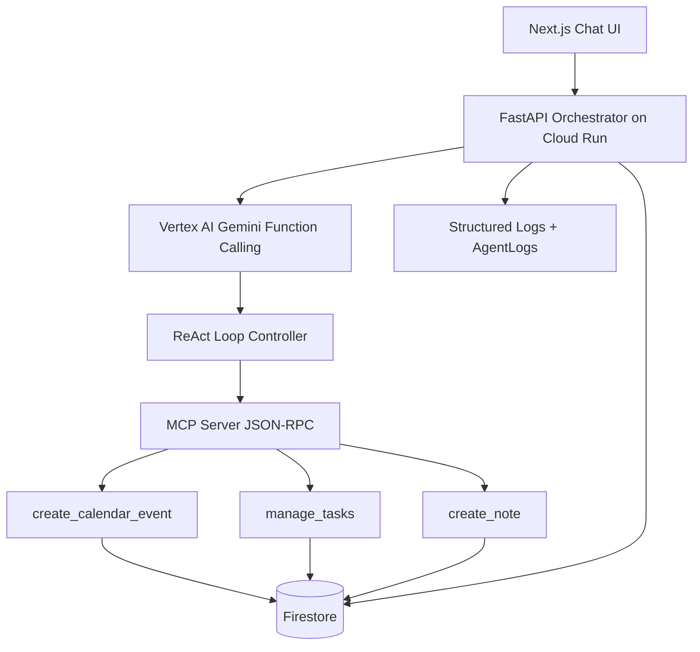

# Multi-Agent AI Productivity System (Google Cloud Gen AI Hackathon)

Production-ready, MCP-based multi-agent architecture using FastAPI, Vertex AI Gemini function calling, Firestore state, and Cloud Run deployment.

## Architecture



### Core design choices
- No string-matching routing for intents.
- Gemini decides tool selection via function calling schemas.
- Backend orchestrator only executes model-declared tools over MCP.
- Firestore stores user data and workflow memory.
- Security includes JWT, RBAC, prompt injection filtering, and per-IP rate limiting.

## Folder Structure

```text
backend/
  app/
    main.py
    config/
      __init__.py
    routes/
      __init__.py
    api/
      routes.py
    agents/
      orchestrator.py
      tool_router.py
      task_agent.py
      calendar_agent.py
      notes_agent.py
      base.py
    services/
      llm_service.py
      function_registry.py
      container.py
    mcp_client/
      client.py
    db/
      repositories.py
      firestore_repository.py
    models/
      schemas.py
    core/
      config.py
      security.py
      logging_config.py
    middleware/
      rate_limit.py
    utils/
      sanitization.py
  tests/
    test_orchestrator.py
    test_api_workflow.py
  requirements.txt
  Dockerfile

mcp-server/
  server.py
  tools/
    calendar.py
    tasks.py
    notes.py
    firestore_store.py
  requirements.txt
  Dockerfile

frontend/
  app/
    layout.tsx
    page.tsx
    globals.css
  package.json
```

## Backend Runtime

### Local backend run
```bash
cd backend
python -m venv .venv
# Windows:
.venv\Scripts\activate
pip install -r requirements.txt
copy .env.example .env
uvicorn app.main:app --host 0.0.0.0 --port 8080
```

### Local MCP server run
```bash
cd mcp-server
python -m venv .venv
.venv\Scripts\activate
pip install -r requirements.txt
uvicorn server:app --host 0.0.0.0 --port 9000
```

## Vertex AI Function Calling + ReAct Loop

Implemented in backend/app/services/llm_service.py:
- Declares function schemas for:
  - create_calendar_event
  - manage_tasks
  - create_note
- Calls Gemini through Vertex AI.
- Detects function calls.
- Calls MCP server.
- Feeds tool results back to model.
- Repeats until final answer or max step cap.

## Firestore Collections

- Users
- Tasks
- Events
- Notes
- Conversations
- AgentLogs
- SessionContext

### Memory behavior
- Conversation history persisted each turn.
- SessionContext stores last summary and recent actions.
- AgentLogs store tool decisions and outcomes.

## Security

- JWT access token and role claims.
- RBAC guard on admin logs endpoint.
- Prompt injection detection gate.
- Pydantic input validation.
- Rate limiting middleware.
- Secret Manager integration for JWT secret in production.

## API Endpoints

- POST /v1/auth/token
- POST /v1/workflows/execute
- GET /v1/me/tasks
- GET /v1/me/events
- GET /v1/me/notes
- GET /v1/admin/agent-logs

### Example request
```bash
curl -X POST http://localhost:8080/v1/auth/token \
  -H "Content-Type: application/json" \
  -d '{"user_id":"u1","email":"u1@example.com","role":"user"}'
```

```bash
curl -X POST http://localhost:8080/v1/workflows/execute \
  -H "Authorization: Bearer <TOKEN>" \
  -H "Content-Type: application/json" \
  -d '{"message":"Schedule meeting tomorrow and create notes"}'
```

## Cloud Run Deployment

### 1. Enable APIs
```bash
gcloud services enable run.googleapis.com artifactregistry.googleapis.com \
  aiplatform.googleapis.com secretmanager.googleapis.com firestore.googleapis.com cloudbuild.googleapis.com
```

### 2. Create service account
```bash
gcloud iam service-accounts create productivity-agent-sa \
  --display-name="Productivity Agent SA"
```

### 3. Grant IAM roles
```bash
gcloud projects add-iam-policy-binding <PROJECT_ID> \
  --member="serviceAccount:productivity-agent-sa@<PROJECT_ID>.iam.gserviceaccount.com" \
  --role="roles/aiplatform.user"

gcloud projects add-iam-policy-binding <PROJECT_ID> \
  --member="serviceAccount:productivity-agent-sa@<PROJECT_ID>.iam.gserviceaccount.com" \
  --role="roles/datastore.user"

gcloud projects add-iam-policy-binding <PROJECT_ID> \
  --member="serviceAccount:productivity-agent-sa@<PROJECT_ID>.iam.gserviceaccount.com" \
  --role="roles/secretmanager.secretAccessor"
```

### 4. Create Artifact Registry
```bash
gcloud artifacts repositories create productivity-repo \
  --repository-format=docker --location=us-central1
```

### 5. Build and push backend image
```bash
cd backend
gcloud builds submit --tag us-central1-docker.pkg.dev/<PROJECT_ID>/productivity-repo/backend:latest
```

### 6. Deploy backend to Cloud Run
```bash
gcloud run deploy productivity-backend \
  --image us-central1-docker.pkg.dev/<PROJECT_ID>/productivity-repo/backend:latest \
  --region us-central1 \
  --service-account productivity-agent-sa@<PROJECT_ID>.iam.gserviceaccount.com \
  --set-env-vars GOOGLE_CLOUD_PROJECT=<PROJECT_ID>,GOOGLE_CLOUD_LOCATION=us-central1,VERTEX_MODEL_NAME=gemini-1.5-pro-002,MCP_SERVER_URL=https://<MCP_URL>,ENABLE_FIRESTORE=true,ENVIRONMENT=prod,JWT_SECRET_SECRET_NAME=multi-agent-jwt-secret \
  --allow-unauthenticated
```

### 7. Build and deploy MCP server
```bash
cd ../mcp-server
gcloud builds submit --tag us-central1-docker.pkg.dev/<PROJECT_ID>/productivity-repo/mcp:latest

gcloud run deploy productivity-mcp \
  --image us-central1-docker.pkg.dev/<PROJECT_ID>/productivity-repo/mcp:latest \
  --region us-central1 \
  --service-account productivity-agent-sa@<PROJECT_ID>.iam.gserviceaccount.com \
  --set-env-vars GOOGLE_CLOUD_PROJECT=<PROJECT_ID>,FIRESTORE_DATABASE=(default) \
  --allow-unauthenticated
```

## Tests

```bash
cd backend
python -m pytest -q
```

- Unit test: orchestrator multi-step coordination.
- Integration test: auth + workflow endpoint flow.

## Demo Workflows

### Example 1
Input: "Schedule meeting tomorrow and create notes"
- Gemini emits function call: create_calendar_event
- Orchestrator calls MCP
- Gemini emits function call: create_note
- Orchestrator calls MCP
- Data persisted in Events/Notes/Conversations/AgentLogs
- Final summary returned

### Example 2
Input: "Plan my day"
- Gemini can emit sequence: manage_tasks, create_calendar_event, create_note
- ReAct loop executes each tool call step-by-step
- Session context updated for follow-up prompts
